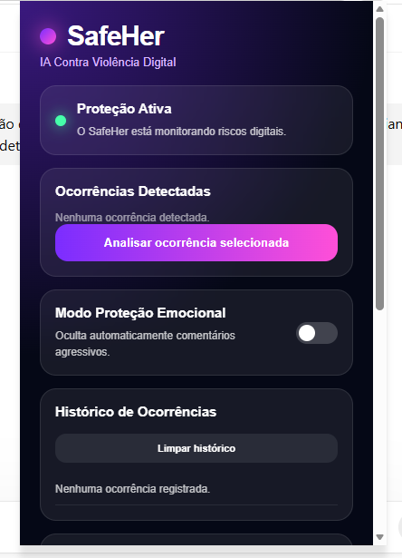
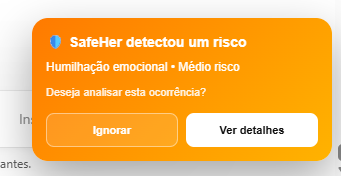

# SafeHer — Proteção Digital para Mulheres

O SafeHer é uma extensão para Chrome criada para ajudar na identificação de situações de violência digital.

A ideia surgiu a partir da percepção de que muitas mensagens ofensivas, ameaças, assédio e ataques em ambientes digitais podem ser difíceis de identificar ou até mesmo normalizados no dia a dia.

O projeto busca facilitar esse reconhecimento e oferecer alguns recursos para registro e orientação.

## O que o SafeHer faz

* Identifica mensagens que podem apresentar conteúdo ofensivo ou ameaçador
* Classifica o nível de risco
* Identifica diferentes categorias de violência digital
* Exibe alertas
* Possui um modo de proteção emocional
* Mantém um histórico das ocorrências
* Permite o registro de evidências
* Apresenta opções de apoio e encaminhamento

## Categorias consideradas

O protótipo trabalha com algumas categorias de violência digital:

* Ameaça física
* Assédio
* Humilhação emocional
* Ataque intelectual ou profissional
* Preconceito e racismo

## Algumas telas

### Interface

### Reconhecimento da mensagem

### Popup

### Ações

### Histórico e encaminhamento

### Modo proteção emocional

### Demonstração do modo proteção emocional

## Tecnologias

* HTML
* CSS
* JavaScript
* Chrome Extension Manifest V3
* Local Storage

## Como instalar

Para testar o protótipo:

1. Abra o Google Chrome.
2. Acesse `chrome://extensions`.
3. Ative o modo desenvolvedor.
4. Clique em **Carregar sem compactação**.
5. Selecione a pasta `extension`.

## Status

O SafeHer é um **protótipo funcional desenvolvido para fins acadêmicos**.

Algumas funcionalidades ainda podem ser aprimoradas e novas possibilidades estão previstas para futuras versões.

## Ideias para futuras versões

* Análise contextual utilizando IA
* Identificação de conteúdo ofensivo em imagens
* Análise de áudio e vídeo
* Geração de relatórios em PDF
* Painel web
* Histórico mais completo das ocorrências
* Análise de reincidência

## Sobre o projeto

O SafeHer faz parte dos projetos que desenvolvi durante minha formação em tecnologia, unindo desenvolvimento, interface e uma situação real que poderia ser trabalhada por meio de uma solução digital.

**Andreia Contes**
